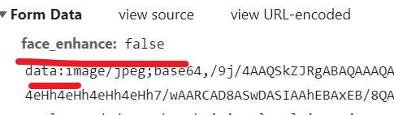
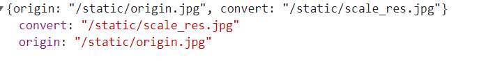
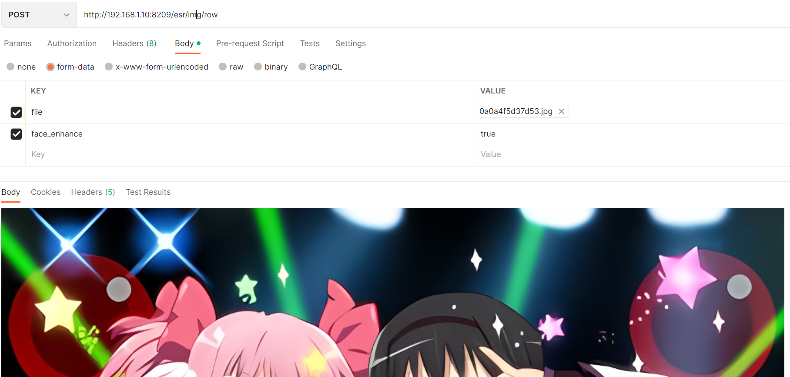
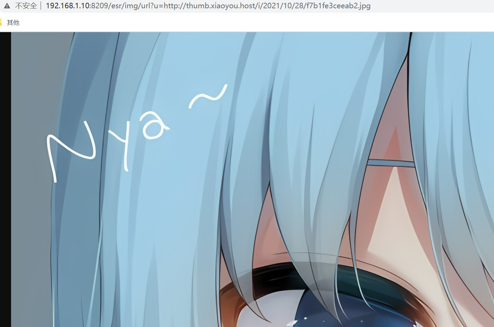
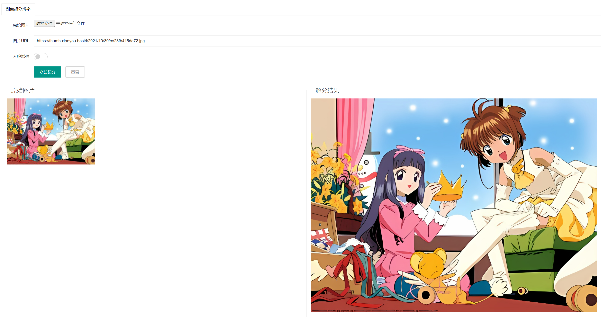
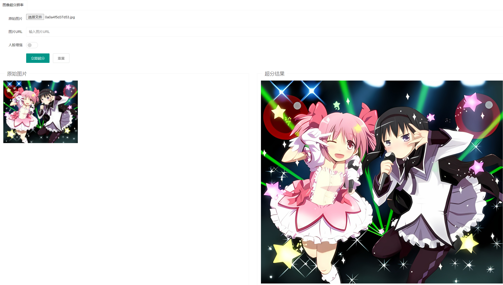

# 图像超分辨率项目

> 源项目地址：https://github.com/xinntao/Real-ESRGAN
> 
> 本项目只是套壳，加了三个方便使用的api

## 项目运行

项目使用方法可以去参考原项目，这里只需要注意一些模型文件替换

把`GFPGANv1.3.pth`和 `RealESRGAN_x4plus_anime_6B.pth`放到`weights`目录

然后再把`detection_Resnet50_Final.pth`和`parsing_parsenet.pth`放到`gfpgan/weights`目录下

## 项目使用

### 接口1: `/esr/img` 

post请求，然后表单里面传入这两个参数，data是图片的base64编码

返回原始图和转换后的图的url

### 接口2： `/esr/img/row`

post请求，传入图片文件，直接返回转换后的图片

### 接口3： `/esr/img/url?u=xx`

get请求，u里面直接填图片的url地址，然后会直接返回超分的结果

### 视频超分

直接参考 `video_convert.py` 这个会逐帧去掉接口，最后再合成

## 项目截图

